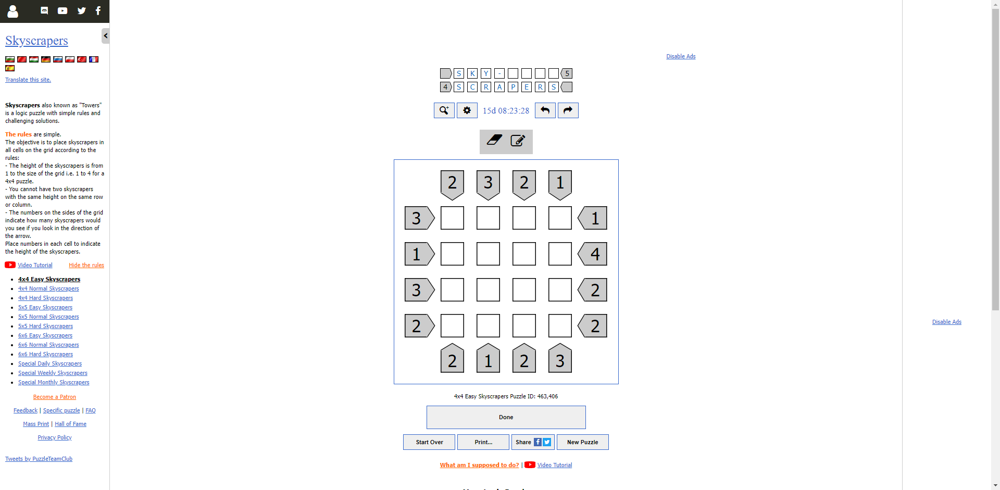
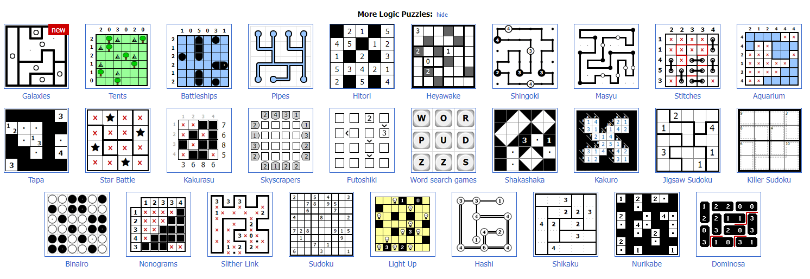
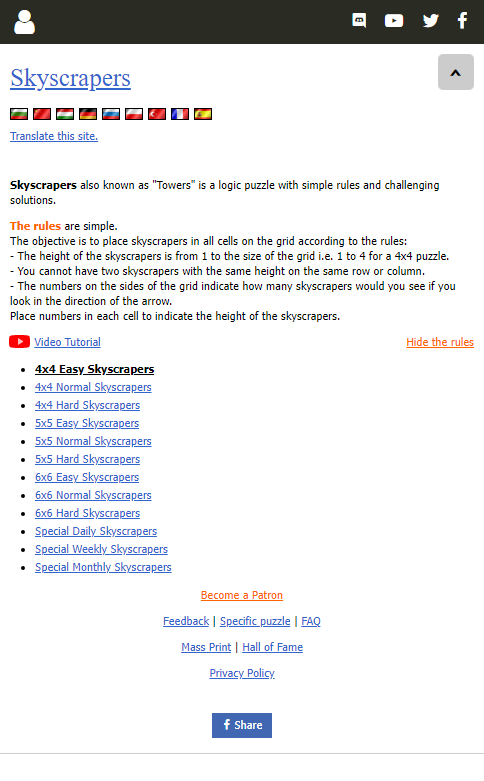
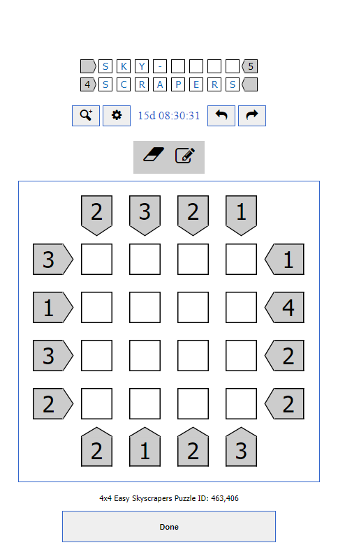
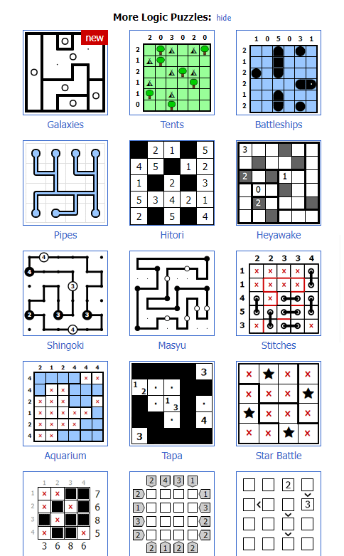

<h2 style="float: left; width: 50%; text-align: left; height: 90px">Logic Puzzle Web stranica</h2><h3 style="float: right; text-align: right; width: 50%; height:90px">David Majdandžić</h3>

## **Stranica**

Stranica će se sastojati od *nekoliko* stranica koja će svaka za sebe reprezentirati i ponašati se kao logička puzla/igra gdje će se korisnici moći registrirati i igrati igru po izboru te će njihovi rezultati biti zabilježeni na ljestvici

Na kraju svake "stranice" (igre) nalazit će se poveznice na ostale raspoložive igre u obliku slika ili slično

Inspiracija uzeta sa www.puzzle-skyscrapers.com

Note: Link vodi na jednu od raspoloživih igara

- Izgled postojeće stranice koju želim "replicirati" (ne u potpunosti)

- Poveznice na ostale raspoložive igre

## **Same igre // baza podataka**

Generatore i solvere za same logičke igre bi bilo poprilično zahtjevno i teško napisati pa su neke od solucija
1. Napraviti samo 1 igru
2. Napraviti nekoliko igara
3. Napraviti bazu podataka sa nekoliko setova problema i rješenja za veći broj igara

Također je potrebna baza podataka za korisničke račune i stanje ljestvice

## **Responzivni dizajn**

Izgled stranice na mobilnim uređajima
<table>
    <tr>
        <td>
        <td>
        <td>
    </tr>
</table>

## **Cookies**

Stranica sprema stanje ploče za svakog pojedinog igrača zajedno sa njihovim vremenom rješavanja i ostalim podacima koji se odnose na igru

## **Napomena**

Prikazano **NIJE** moja web stranica niti ju planiram direktno kopirati no želim napraviti jednu na isti princip kao prikazana web stranica
